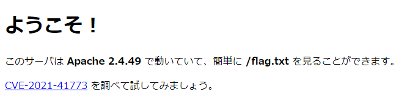

# CVE-2021-41773



CVE-2021-41773、つまりapacheのパストラバーサルです。  
原理を理解しようとするとURLエンコードや相対パスの概念を理解する必要がありますが、再現するだけならそんな必要もありません。

「CVE-2021-41773 exploit」とかで根気よく調べると、次のようなペイロードが見つけられると思います。

```txt
http://$host/cgi-bin/.%2e/.%2e/.%2e/.%2e/etc/passwd
```

とりあえずこのペイロードに沿ってリクエストを送信してみましょう。

ブラウザで<http://localhost:8080/cgi-bin/.%2e/.%2e/.%2e/.%2e/etc/passwd>とかにアクセスしても、ブラウザが<http://localhost:8080/etc/passwd>に最適化してしまうのでcurlを使います。  
この辺のツールの選択も、調べ方によってはすぐ出るかと思います。


`/etc/passwd`が盗れました。  
問題文では`/flag.txt`だと言っているので、`/flag.txt`を見ます。


flagゲット！
  
`flag{4p4ch3_p4th_tr4v3rs4l}`
