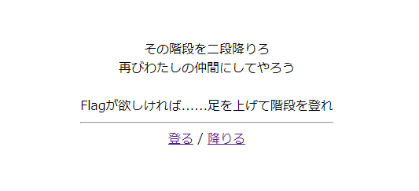
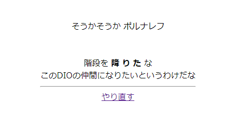
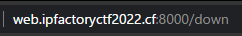
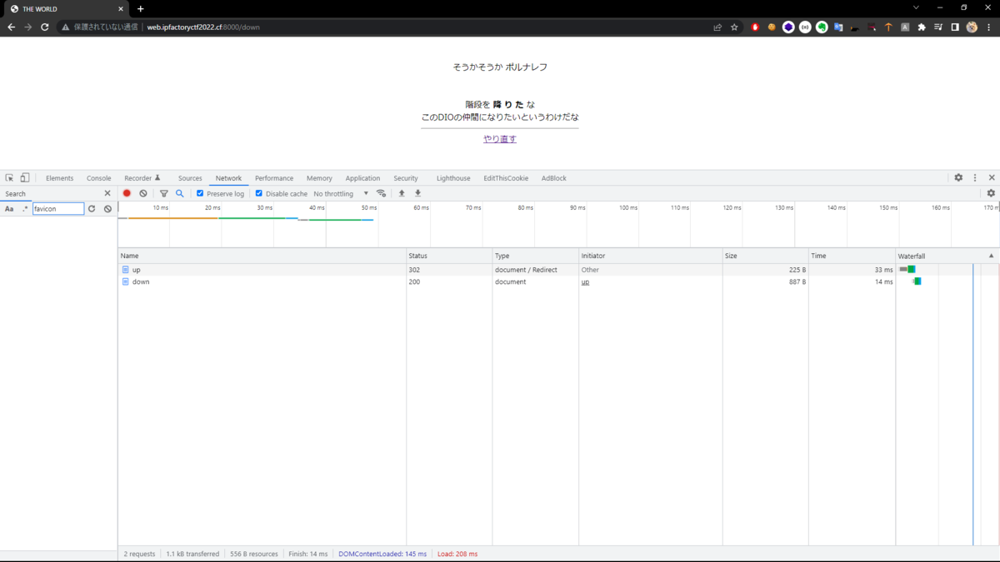
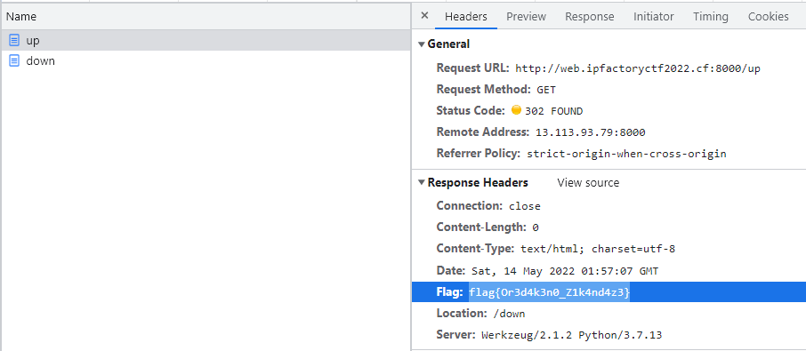

# THE WORLD

welcome問題です。  
アクセスすると以下のような表示。



登る・降りるのリンクがあり、それぞれ`/up`, `/down`に遷移します。

```html
<a href="/up">登る</a> / <a href="/down">降りる</a><br>
```

階段を登ればflagをくれるようなので、登ってみましょう。



『おれはやつの前で階段を登っていたと思ったらいつのまにか降りていた』というやつです。  
確かに`/up`に飛んだはずですが、URLバーを見るとなぜか`/down` に居ます。



`/up` にアクセスした際に動くコードを見てみましょう。

```python
@app.route("/up")
def theworld():
    resp = make_response()
    resp.headers['Flag'] = os.environ['flag']
    resp.headers['Location'] = '/down'
    return resp, 302
```

`resp.headers['Location'] = '/down'` という部分の所為で`/down`にリダイレクトさせられてしまっています。  
他に、`resp.headers['Flag'] = os.environ['flag']` というのもありますね。  
`/down` へのリダイレクト命令の他にも、flagがくっついているようです。

`resp.headers` 等で調べると、どうやらHTTPヘッダーというものらしいことがわかります。  
HTTPヘッダーを見る方法があればflagが見れそうです。

HTTPヘッダーを見る方法はいろいろありますが、今回はブラウザで見る方法をやってみます。

ブラウザにフォーカスしている状態でF12キーを押すと、「開発者ツール」が開けます。  
Networkというタブを開いた状態で、トップページの"登る"リンクをクリックしてみましょう。



`/up`と`/down` のログがでてきます。今見たいのは`/up`の時のレスポンスなので、`/up`をクリック。



Response Headersの中に`Location: /down`と`Flag: ...`があります。

`flag{Or3d4k3n0_Z1k4nd4z3}`
