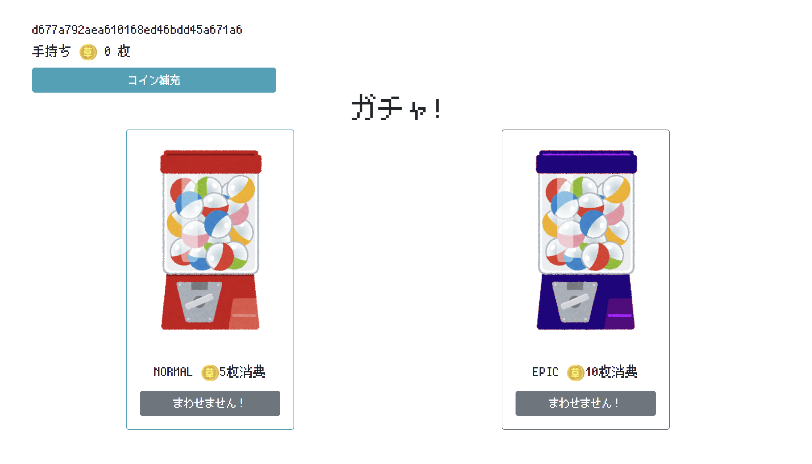

# Do you wanna epic prize?

SECCON Beginners CTF 2021 の cant_use_db を ~~パクった~~ オマージュした問題。

アクセスすると以下のような表示。



コインは最初0枚で `コインを補充` ボタンを押すと、コインが５枚補充することができる。

しかしながらコインを一回補充するとボタンは消えてしまうため、コインは１０枚以上にすることができずEPICガチャを引くことができない。

NORMALガチャはハズレの 💩 がでる。

どのようにすればflagを取得できるかソースコードを確認してみる。

`gacha.php`  9~22行目
```php
$coins = 0;
if (isset($_SESSION['coins'])) {
    $coins = (int) $_SESSION['coins'];
}

if ($_POST['epic'] === "true" && 10 <= $coins) {
    $coins -= 10;
    echo 'Super Rare! 🏁' . $_ENV["flag"] . '🏁';
} else if ($_POST['epic'] === "false" && 5 <= $coins) {
    $coins -= 5;
    echo '💩';
} else {
    echo 'You are out of coin!';
}
```
セッションに保持してあるコインが10枚以上でEPICガチャを引けば、flagを取得できることがわかる。

次に、コインを補充する処理を見てみると

`replenish.php` 9~12行目
```php
if (isset($_SESSION['coins'])) {
    $coins = (int)$_SESSION['coins'] + 5;
    $_SESSION['coins'] = $coins;
}
```
セッションのcoinsに5を足しているだけ。

現在のコインの値が何枚以上であるかなどをチェックしているわけではないので、 複数回 `コインを補充` ボタンを押すことができればコインの枚数を10枚以上にすることができるとこがわかった。

複数回ボタンを押すために手っ取り早いやりかたとして **「複数のタブでページを開く」** があります。

コインが0枚の状態で問題のページを２つ以上開いて、片方のページで補充ボタンを押します。

コインは5枚に増えますが、もう片方のページの補充ボタンは消えていません。

そのボタンを押すと、コインは10枚に増えEPICガチャを引くことができます。

`flag{g10r10u5_g01d3n}`

別解

- コイン補充ボタンをめちゃめちゃ連打することで、コイン補充ボタンが消える前に2回以上リクエストを送信する
- burp suiteのようなproxyツールでせき止めている間にボタンを複数回押し、interceptを解除する
